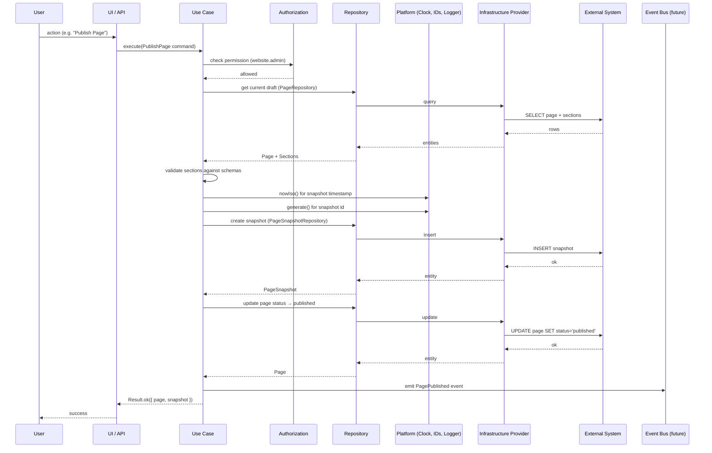
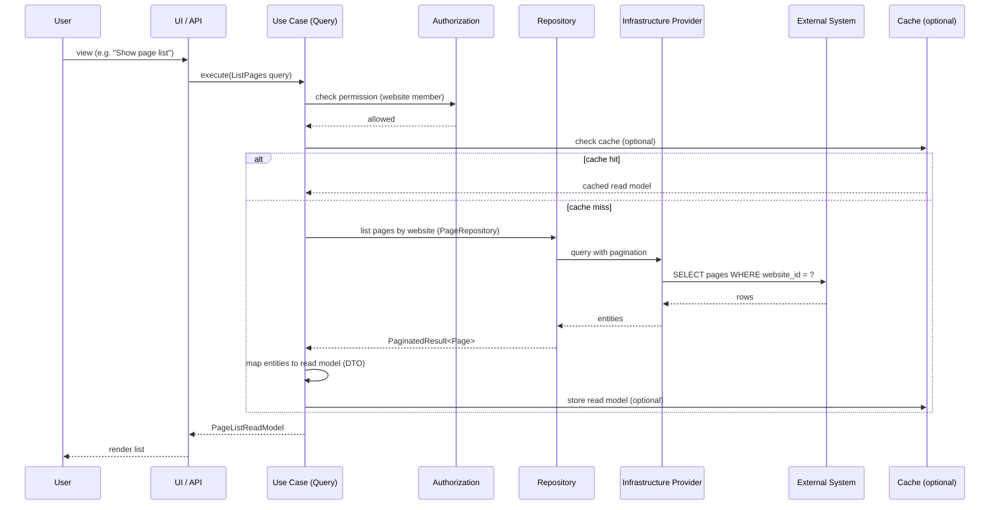
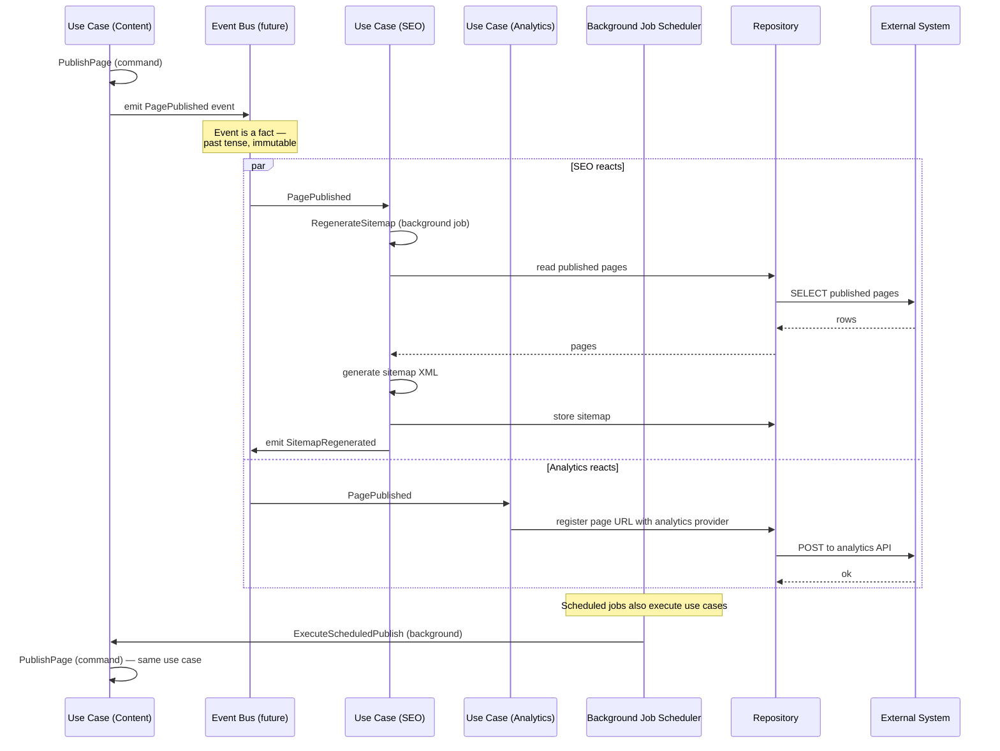
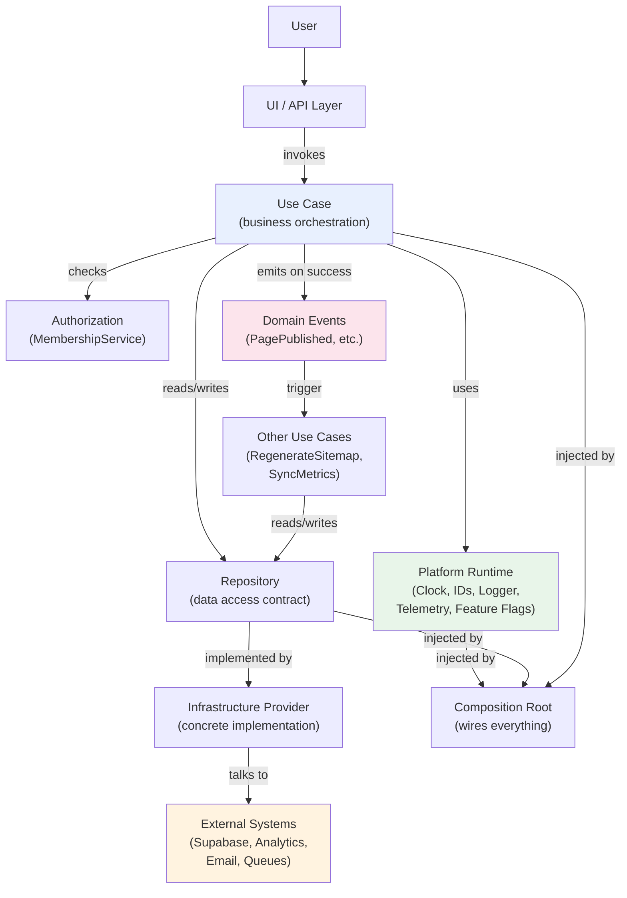
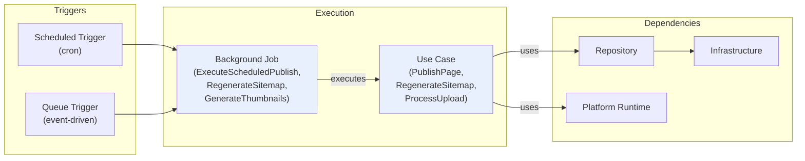
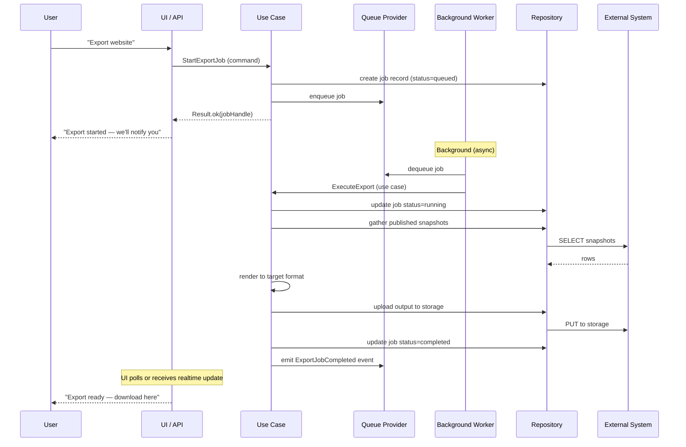

# Living Sites — Application Flow

> **Status:** Architecture only. No implementation in this milestone.

## Overview

This document describes how a user request flows through the Living Sites
architecture — from the UI, through a use case, through repositories, through
platform runtime capabilities, through infrastructure providers, to external
systems. It covers three flow types: **command flow** (mutations), **query
flow** (reads), and **event flow** (asynchronous reactions).

## Dependency Stack

```
User Request
    ↓
UI / API Layer
    ↓
Use Case (business orchestration)
    ↓
Repositories (data access contracts)
    ↓
Platform Runtime (logging, clock, ids, telemetry, feature flags)
    ↓
Infrastructure Providers (concrete implementations)
    ↓
External Systems (Supabase Postgres, Storage, Analytics SDKs, Email, Queues)
```

Every layer depends on the contract of the layer below. No layer skips a
level. The UI never calls a repository. A repository never calls an external
system directly — it goes through an infrastructure provider. Platform
runtime capabilities are injected at every level by the composition root.

## Command Flow

A **command** is a use case that mutates state. Commands return
`Result<T, DomainError>`, never read models. Every mutation in the platform
originates from a command use case — there is no other path to mutate data.



### Command rules

1. **Every mutation originates from a use case.** No code outside a use case
   writes to a repository.
2. **Commands never return read models.** A command returns the mutated
   entity or a `DomainError`. If the UI needs a read model after a mutation,
   it issues a separate query.
3. **Authorization is checked inside the use case**, not in the UI. The UI may
   hide controls for UX, but the use case re-checks on execution.
4. **Events are emitted only after the use case completes successfully.** If
   the use case fails (returns an error), no event is emitted.
5. **Platform capabilities (clock, IDs) are used inside the use case** to
   generate timestamps and identifiers — never `Date.now()` or
   `crypto.randomUUID()` directly.

## Query Flow

A **query** is a use case that reads state. Queries never mutate. Queries
return read models (DTOs), not domain entities — the UI receives shapes
designed for display, not internal entity structures.



### Query rules

1. **Queries never mutate state.** A query use case has no write path — it
   does not call insert/update/delete on any repository.
2. **Queries return read models, not entities.** The mapping from entity to
   read model happens inside the query use case, so the UI never sees internal
   entity shapes.
3. **Queries may use caching.** A query may check a cache before hitting the
   repository. Cache invalidation is triggered by events (see Event Flow).
4. **Queries enforce authorization.** A query checks that the caller has
   permission to read the requested data — tenant isolation is a query
   concern, not just a command concern.

## Event Flow

An **event** is a fact about a completed use case. Events flow
asynchronously: a command use case emits an event after it succeeds, and
other contexts react to that event by executing their own use cases.



### Event rules

1. **Events are emitted only by completed use cases.** A failed use case
   emits nothing.
2. **Events are facts, not commands.** Past tense (`PagePublished`, not
   `PublishPage`), immutable, plain data.
3. **Events are owned by the emitting context.** The content context owns
   `PagePublished`; the SEO context subscribes to it.
4. **Subscribers depend on event contracts, not on emitting services.** The
   SEO context knows about `PagePublished` (an event contract), not about
   `PageService` (a service contract).
5. **Background jobs execute use cases.** A background job is not separate
   logic — it calls the same use case a user would, just triggered by a
   schedule or queue instead of a user request.
6. **Event flow is asynchronous.** The emitting use case does not wait for
   subscribers. If a subscriber fails, it retries independently — the
   original use case has already succeeded.

## Full Request Flow (Combined)

This diagram shows the complete dependency chain from user request to
external system, including platform runtime capabilities at each layer.



## Background Job Flow

Background jobs are triggered by either a schedule (cron) or a queue (event-
driven). They execute use cases — they are not separate logic.



## Long-running Operation Flow

Long-running operations span more than one request. They involve a start
command, a background execution phase, and a completion event.



## Key Invariants

| Invariant | Enforcement |
|---|---|
| Every mutation originates from a use case. | No code outside `use-cases/` calls repository write methods. Lint rule + review. |
| Queries never mutate state. | Query use cases have no write-path repository calls. Review + test. |
| Commands never return read models. | Command return types are `Result<Entity, DomainError>`, not DTOs. Type system. |
| Events emitted only by completed use cases. | The event emission call is the last line before `Result.ok`. Review. |
| Background jobs execute use cases. | Background job functions call use case methods — no inline business logic. Review. |
| Repositories never contain business rules. | Repository interfaces are data-access only (get, insert, update, delete). No validation, no authorization, no orchestration. Interface shape + review. |
| Services never bypass use cases. | Service implementations call use case methods — no direct repository writes outside a use case. Review. |
