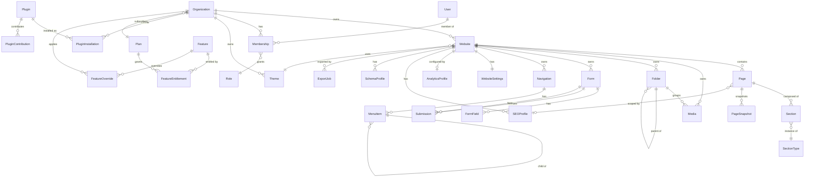
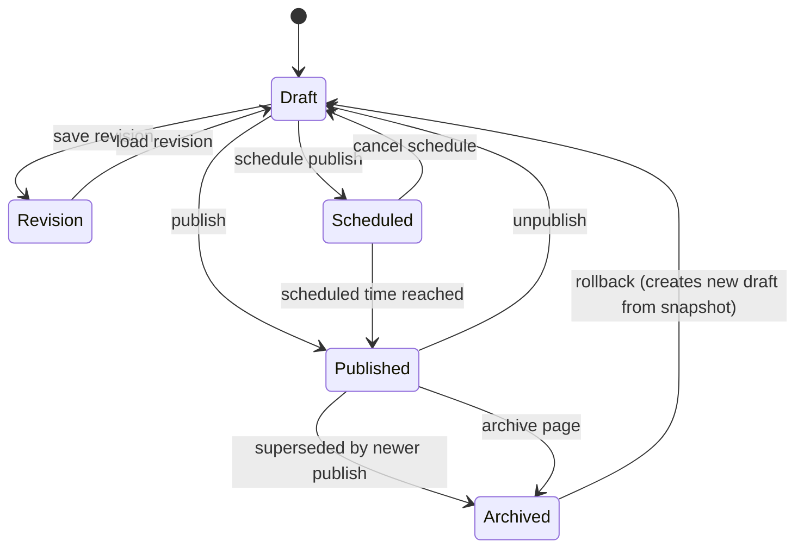
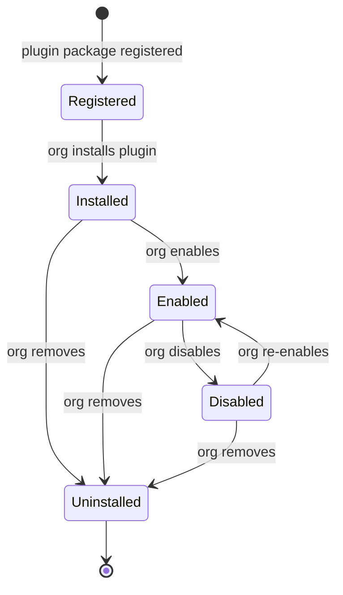
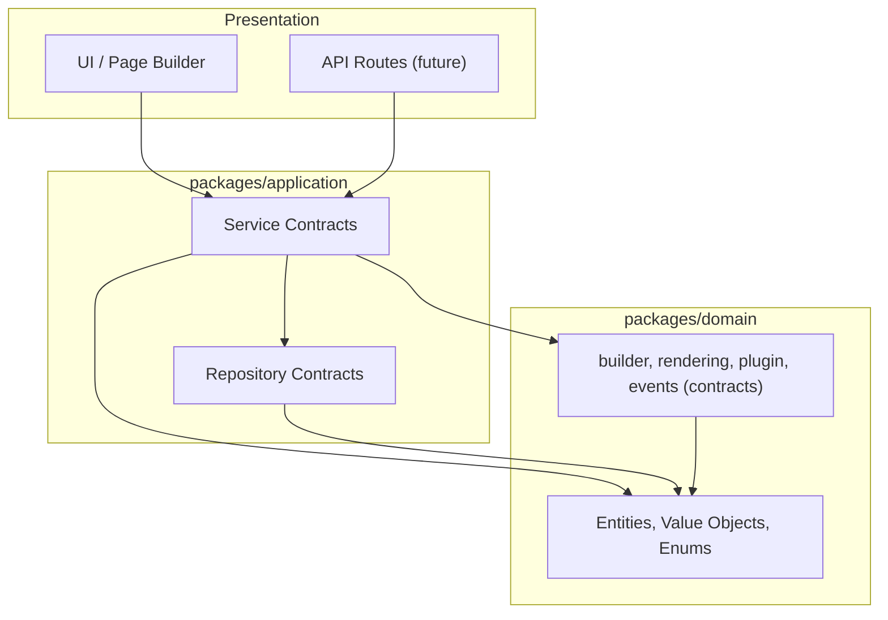

# Living Sites — Domain Model

> **Status:** Architecture only. No implementation, no database, no API, no UI.
> This document defines the permanent domain architecture for the Living Sites
> platform, a commercial multi-tenant SaaS website builder. The first customer
> is Tajon Construction, but **no client-specific value is hardcoded** in the
> model — every entity is tenant-parametrized.

## 1. Overview

Living Sites is a multi-tenant SaaS platform where many **Organizations** each
own many **Websites**. A Website is composed of **Pages**, each an ordered list
of **Sections** — instances of registered **SectionTypes**. Content is enriched
with **Media**, **Forms**, **SEO profiles**, **Themes**, and **Analytics**.

### Package structure

The architecture is split into two packages with a strict dependency direction:

- **`@livingsites/domain`** — the domain model. Contains **only** entities,
  value objects, enums, and types. No service contracts, no repository
  contracts, no I/O, no framework bindings. Depends on nothing.
- **`@livingsites/application`** — the application layer. Contains repository
  contracts and service contracts. Depends on `@livingsites/domain` for entity
  types. No implementation — interfaces only.

```
UI / API  →  @livingsites/application (services)  →  @livingsites/domain (entities)
                     ↕
          repositories (wiring root only)
```

The domain is organized into **bounded contexts**, each a folder under
`packages/domain/src/<context>/`. Core content contexts expose `types.ts`
(entities), `enums.ts` (enumerations), and `index.ts` (barrel). Reserved
contexts (`builder`, `rendering`, `plugin`, `events`) expose `index.ts`
(contracts) and `README.md` (responsibilities). Repository and service
contracts for all contexts live in `packages/application/src/`.

### Design principles

1. **Tenant isolation by construction.** Every business entity resolves up to
   exactly one Organization. Ownership is modeled on the entity, not inferred.
2. **Contracts before implementation.** Types, enums, repository interfaces,
   and service interfaces are stable seams. Implementations may be swapped
   (database provider, storage backend, analytics provider) without breaking
   callers.
3. **Sections are registered components, not free-form HTML.** A Section is an
   instance of a SectionType whose props schema is defined in a registry.
4. **Business logic in services, data access in repositories.** UI never
   touches repositories; it calls services. Services call repositories.
5. **Domain depends on nothing.** The domain package has zero dependencies.
   Application depends on domain. UI depends on application. No arrow points
   the other way.
6. **Future-proofed for scale.** Branded IDs, pagination contracts, and
   `Result<T,E>` return shapes are used everywhere so the platform can scale to
   hundreds of orgs and thousands of sites without rework.

---

## 2. Bounded Contexts

### Core content contexts (domain entities + application contracts)

| Context | Domain location | Responsibility | Core entities |
|---|---|---|---|
| `organization` | `domain/organization` | Top-level tenant and subscription/entitlements. | `Organization`, `Plan`, `Feature` |
| `users` | `domain/users` | Identity and org membership/authorization. | `User`, `Membership`, `Role` |
| `website` | `domain/website` | A single publishable site and its settings. | `Website`, `WebsiteSettings` |
| `navigation` | `domain/navigation` | Menus and menu items for a website. | `Navigation`, `MenuItem` |
| `theme` | `domain/theme` | Visual design tokens and section-type support. | `Theme`, `ThemeTokens` |
| `page` | `domain/page` | Addressable routes within a website. | `Page`, `PageSnapshot` |
| `section` | `domain/section` | Atomic content blocks placed on pages. | `Section`, `SectionType` |
| `media` | `domain/media` | Binary asset library per website. | `Media`, `Folder` |
| `seo` | `domain/seo` | Search optimization and structured data. | `SEOProfile`, `SchemaProfile`, `RobotsPolicy`, `SitemapEntry` |
| `analytics` | `domain/analytics` | Measurement config and aggregated metrics. | `AnalyticsProfile`, `AnalyticsSummary`, `MetricSeries` |
| `forms` | `domain/forms` | Visitor data capture. | `Form`, `FormField`, `Submission` |
| `export` | `domain/export` | Portable website bundles. | `ExportJob` |

### Reserved contexts (contracts + documentation only)

| Context | Domain location | Responsibility | Status |
|---|---|---|---|
| `builder` | `domain/builder` | Authoring-surface vocabulary: canvas, placement intents. | Reserved |
| `rendering` | `domain/rendering` | Public-rendering pipeline: rendered output, render context. | Reserved |
| `plugin` | `domain/plugin` | Plugin system: manifest, contributions, installation, lifecycle. | Reserved |
| `events` | `domain/events` | Domain event vocabulary: `PagePublished`, `FormSubmitted`, etc. | Reserved |

Repository and service contracts for all contexts live in
`packages/application/src/repositories/` and `packages/application/src/services/`.
Cross-context orchestration services (`BuilderService`, `RenderingService`) live
in `packages/application/src/services/cross-context.ts`.

---

## 3. Entity Catalog

### 3.1 Organization

- **Responsibilities:** The commercial tenant. Owns websites, memberships, and
  a subscription plan. Carries feature overrides on top of the plan baseline.
- **Relationships:** `1 Organization → many Websites`; `1 Organization → many
  Memberships`; `1 Organization → 1 Plan (optional)`.
- **Lifecycle:** `active` → `archived` → `deleted` (soft delete). An archived
  org suspends all its websites; deletion is reversible within a retention
  window.
- **Validation:**
  - `slug` is globally unique, lowercase, `[a-z0-9-]`, 3–40 chars.
  - `billingEmail` is a valid email.
  - `planId` must reference an active `Plan` or be `null` (trialing).
- **Extensibility:** `featureOverrides` allows per-org capability grants
  without new schema columns. Future: org-level branding, multiple billing
  entities per org.

### 3.2 Plan

- **Responsibilities:** A platform-global subscription tier. Grants a baseline
  of `FeatureEntitlement`s and sets limits (maxWebsites, maxMembers,
  customDomainsAllowed).
- **Relationships:** `1 Plan → many Organizations`.
- **Lifecycle:** `isActive` flag; never hard-deleted (referenced by historical
  orgs). New tiers added by creating new Plans.
- **Validation:** `priceMonthly`/`priceAnnual` ≥ 0; `currency` is ISO 4217;
  `maxWebsites`/`maxMembers` ≥ 0 or `null` (unlimited).
- **Extensibility:** New feature keys are added to `Feature` and referenced by
  entitlements — no Plan schema change needed.

### 3.3 Feature

- **Responsibilities:** A discrete capability or limit (e.g. `max_pages`,
  `ai_assistant`, `custom_domains`). Granted by Plans, overridable per-Org.
- **Relationships:** `1 Feature → many FeatureEntitlements (via Plan)`;
  `1 Feature → many FeatureOverrides (via Organization)`.
- **Validation:** `key` is a stable machine key, unique; `valueType` is
  `boolean` or `number`.
- **Extensibility:** Features are the primary extensibility vector for
  monetization — new capabilities ship as new Features.

### 3.4 User

- **Responsibilities:** Platform-level identity. Not scoped to a single org;
  one user may belong to many orgs via Memberships.
- **Relationships:** `1 User → many Memberships`.
- **Lifecycle:** `active` → `archived` → `deleted`. Deactivation does not
  remove Memberships; it disables sign-in.
- **Validation:** `email` unique, lowercased, valid email format;
  `displayName` 1–100 chars.
- **Extensibility:** Future: SSO provider linkage, MFA enrollment, profile
  fields — all additive.

### 3.5 Membership

- **Responsibilities:** Binds a User to an Organization with a Role. Optionally
  scoped to a single Website within the org. This is the **only** place
  authorization is derived from — never a role field on User.
- **Relationships:** `N Membership → 1 Organization`; `N Membership → 1 User`;
  optional `N Membership → 1 Website` (scope).
- **Lifecycle:** `active` → `archived`. Revoking = soft-delete.
- **Validation:** `(organizationId, userId)` unique; `role` must be a known
  `SystemRole` or org-defined role key; if `websiteScopeId` is set it must
  belong to the same org.
- **Extensibility:** Custom org roles, time-limited memberships, granular
  per-resource scopes.

### 3.6 Role

- **Responsibilities:** A named bundle of permission keys. System roles
  (Owner, Admin, Editor, Author, Viewer) are immutable; future custom roles
  are org-scoped.
- **Relationships:** Referenced by `Membership.role`.
- **Validation:** `key` unique within its scope; `permissions` is a list of
  known permission strings; system roles have `isSystem = true` and cannot be
  deleted.
- **Extensibility:** Custom roles with arbitrary permission sets per org.

### 3.7 Website

- **Responsibilities:** A single publishable site. Carries domain config,
  status, theme reference, locales, and a published version.
- **Relationships:** `N Websites → 1 Organization`; `1 Website → many Pages,
  Media, Folders, Forms, Navigations, SEOProfiles, AnalyticsProfile,
  WebsiteSettings`; `1 Website → 1 Theme` (via `themeId`).
- **Lifecycle:** `draft` → `published` → `unpublished` → `archived`.
  Publishing creates an immutable `PageSnapshot` per page.
- **Validation:**
  - `slug` unique within the org.
  - `customDomain` unique globally, normalized lowercase, valid hostname;
    requires `Plan.customDomainsAllowed`.
  - `fallbackDomain` platform-assigned, unique globally.
  - `defaultLocale` must be in `enabledLocales`.
  - Website count per org ≤ `Plan.maxWebsites` (enforced by WebsiteService).
- **Extensibility:** Multiple custom domains, staging environments,
  site-copy/migration.

### 3.8 WebsiteSettings

- **Responsibilities:** Website-scoped non-content config: password protection,
  indexing toggle, social defaults, header/footer script injection, favicon.
- **Relationships:** `1 WebsiteSettings → 1 Website`.
- **Validation:** `headerScripts`/`footerScripts` are admin-only and
  sanitization-validated before storage; `passwordHash` never returned to UI.
- **Extensibility:** CSP headers, redirect rules, localization fallbacks.

### 3.9 Navigation / MenuItem

- **Responsibilities:** Ordered menu structure for a website. A website may
  have multiple menus (header, footer, mobile). MenuItems target pages, URLs,
  media, or sections; support nesting.
- **Relationships:** `N Navigation → 1 Website`; `1 Navigation → many
  MenuItems`; MenuItem → optional child MenuItems.
- **Validation:** `key` unique per website; target references must resolve to
  real pages/media within the same website; no cycles in nested items.
- **Extensibility:** Dynamic menus generated from page tree, AI-suggested nav.

### 3.10 Theme

- **Responsibilities:** Visual design tokens + the set of SectionTypes the
  theme can render. System themes are platform-provided; org themes are
  customizable.
- **Relationships:** `N Themes → 1 Organization` (or platform for system
  themes); referenced by `Website.themeId`.
- **Validation:** `key` unique within org; `supportedSectionTypes` must
  reference registered SectionTypes; `tokens` is a serializable object.
- **Extensibility:** Theme inheritance, per-website theme overrides,
  marketplace themes.

### 3.11 Page

- **Responsibilities:** A single addressable route. Composed of an ordered
  list of Sections. May be nested under a parent Page for hierarchical routes.
  Exactly one Page per Website is the homepage.
- **Relationships:** `N Pages → 1 Website`; `1 Page → many Sections`;
  optional `Page → parent Page`; `1 Page → 0..1 SEOProfile`;
  `1 Page → many PageSnapshots`.
- **Lifecycle:** `draft` → `published` → `scheduled` → `archived`. Publishing
  freezes a `PageSnapshot`. See §5 Versioning Engine.
- **Validation:**
  - `slug` unique within the website (including nested paths).
  - Exactly one homepage per website (`isHomepage = true`).
  - `parentId` must belong to the same website and not form a cycle.
  - `sectionOrder` must contain exactly the section ids on the page, no dupes.
- **Extensibility:** Page templates, A/B variant pages, scheduled unpublish.

### 3.12 PageSnapshot

- **Responsibilities:** Immutable published snapshot of a page at a point in
  time. Used for rendering, rollback, and export.
- **Relationships:** `N PageSnapshots → 1 Page`.
- **Validation:** `version` semver; `sections` is a serialized, self-contained
  copy (no external references that can dangle).
- **Extensibility:** Diff between snapshots, scheduled rollback.

### 3.13 Section

- **Responsibilities:** A single content block instance on a page. Holds
  concrete `props` matching its SectionType's schema, plus optional per-locale
  overrides.
- **Relationships:** `N Sections → 1 Page`; `N Sections → 1 SectionType`;
  `N Sections → 1 Website`.
- **Lifecycle:** `active` → `archived` → `deleted`. Soft-deleted sections are
  excluded from `sectionOrder` but retained for snapshot history.
- **Validation:** `props` must validate against `SectionType.propsSchema`;
  `sectionTypeId` must reference an active SectionType allowed by the website's
  theme; `sortOrder` ≥ 0.
- **Extensibility:** AI-generated sections, section variants, shared/global
  sections.

### 3.14 SectionType

- **Responsibilities:** A registered, reusable component definition. Defines
  the props schema, category, and rendering constraints. Platform- or
  plugin-provided — never authored per-website.
- **Relationships:** `1 SectionType → many Sections`; referenced by
  `Theme.supportedSectionTypes`.
- **Validation:** `key` globally unique; `propsSchema` is a valid JSON-Schema;
  `version` semver; deactivation (`isActive = false`) hides it from the builder
  but preserves existing instances.
- **Extensibility:** This is the **plugin extensibility vector** — new
  SectionTypes are how third-party capabilities enter the platform.

### 3.15 Media

- **Responsibilities:** A binary asset in a website's library (image, video,
  audio, document). Storage backend is replaceable; the domain models the
  asset, not the transport.
- **Relationships:** `N Media → 1 Website`; optional `N Media → 1 Folder`.
- **Lifecycle:** `active` → `archived` → `deleted`. Deletion removes the
  stored binary after a retention window.
- **Validation:** `mimeType` allowlisted; `sizeBytes` ≤ plan limit;
  `url` is a CDN/storage URL (never a local path); `altText` required for
  images used in content (enforced at publish, not at upload).
- **Extensibility:** AI alt-text generation, CDN transform variants,
  per-asset access control.

### 3.16 Folder

- **Responsibilities:** Organizational grouping for Media within a website.
  Nestable.
- **Relationships:** `N Folders → 1 Website`; optional `Folder → parent Folder`.
- **Validation:** `name` 1–80 chars; no cycles in parent chain; deleting a
  folder moves its media to the parent (or root), never deletes media.
- **Extensibility:** Smart folders, shared cross-website libraries.

### 3.17 SEOProfile

- **Responsibilities:** Per-page or per-website SEO config: title, description,
  canonical, robots directives, OG/Twitter, locale overrides.
- **Relationships:** `N SEOProfiles → 1 Website`; optional `1 SEOProfile → 1
  Page` (page-scoped) or `pageId = null` (website defaults).
- **Validation:** `title` ≤ 60 chars recommended; `description` ≤ 160 chars
  recommended; `canonicalUrl` valid URL; one website-defaults profile per
  website.
- **Extensibility:** Per-locale hreflang emission, AI meta generation.

### 3.18 SchemaProfile

- **Responsibilities:** JSON-LD structured-data profile (e.g.
  `LocalBusiness`, `Article`). Attached to pages or site-wide.
- **Relationships:** `N SchemaProfiles → 1 Website`; `N SchemaProfiles → many
  Pages` (via `pageIds`).
- **Validation:** `schemaType` is a valid Schema.org type; `payload` is valid
  JSON-LD; `key` unique per website.
- **Extensibility:** Template-based schemas with field bindings, AI schema
  suggestion.

### 3.19 AnalyticsProfile

- **Responsibilities:** Per-website analytics provider integration config.
  Stores provider key + config (credential references, never raw secrets),
  server-side forwarding, consent mode.
- **Relationships:** `1 AnalyticsProfile → 1 Website` (one active profile).
- **Validation:** `provider` is a known `AnalyticsProvider`; `config` shape
  validated per provider; raw secrets never persisted in the profile.
- **Extensibility:** Multi-provider fan-out, custom event taxonomy.

### 3.20 Form

- **Responsibilities:** A structured data-capture form within a website.
  Defines fields, notifications, spam protection.
- **Relationships:** `N Forms → 1 Website`; `1 Form → many FormFields`;
  `1 Form → many Submissions`.
- **Lifecycle:** `active` → `archived`. Archived forms stop accepting
  submissions but retain history.
- **Validation:** `key` unique per website; field `key`s unique within form;
  at least one field required; `notifications.emails` are valid addresses.
- **Extensibility:** Multi-step forms, conditional logic, AI form generation.

### 3.21 FormField

- **Responsibilities:** A single field definition. Typed, validated, ordered.
- **Relationships:** `N FormFields → 1 Form`.
- **Validation:** `type` is a known `FormFieldType`; `options` required for
  select/radio/checkbox; `validation` constraints sane (min ≤ max, etc.).
- **Extensibility:** Custom field types via plugins, file upload fields with
  storage integration.

### 3.22 Submission

- **Responsibilities:** A single visitor submission of a form. Append-only
  payload + metadata. Status-tracked for workflow.
- **Relationships:** `N Submissions → 1 Form`; `N Submissions → 1 Website`.
- **Lifecycle:** `new` → `read` → `replied` → `archived`; or `new` → `spam`.
  Payload is immutable after creation.
- **Validation:** Values validate against the form's field definitions;
  required fields present; spam screening passes.
- **Extensibility:** Webhook fan-out, CRM sync, AI spam classification.

### 3.23 ExportJob

- **Responsibilities:** An asynchronous job to package a website (full or
  partial) into a portable format.
- **Relationships:** `N ExportJobs → 1 Website`; `N ExportJobs → 1
  Organization`.
- **Lifecycle:** `pending` → `queued` → `processing` → `completed` (or
  `failed`/`canceled`); `completed` → `expired` after download URL TTL.
- **Validation:** `scope` references valid pages within the website;
  `format` is a known `ExportFormat`; one active job per (website, scope)
  deduplicated to prevent stampedes.
- **Extensibility:** New export formats (WordPress XML, PDF), scheduled
  recurring exports.

### 3.24 Plugin (reserved)

- **Responsibilities:** A registered plugin package that extends the platform
  by contributing SectionTypes, FormFieldTypes, themes, or analytics adapters.
- **Relationships:** `1 Plugin → many PluginInstallations`; `1 Plugin → many
  PluginContributions`; `N PluginInstallations → 1 Organization`.
- **Lifecycle:** `registered → installed → enabled → disabled → uninstalled`.
  See §6 Plugin Architecture.
- **Validation:** `key` globally unique; `requiresPlatformVersion` satisfied;
  `contributions` reference valid contribution kinds.
- **Extensibility:** The plugin system itself is the extensibility mechanism.

### 3.25 PluginInstallation (reserved)

- **Responsibilities:** A plugin installed on a specific Organization with
  enabled/disabled state and per-org configuration.
- **Relationships:** `N PluginInstallations → 1 Organization`;
  `N PluginInstallations → 1 Plugin`.
- **Validation:** One installation per (organization, plugin); `config`
  validated by the plugin's own schema.
- **Extensibility:** Per-website plugin scoping within an org.

### 3.26 Domain Events (reserved)

- **Responsibilities:** Discrete, immutable, past-tense facts about something
  that happened in the domain. The mechanism for cross-context communication
  without direct coupling.
- **Relationships:** Emitted by a context; consumed by any number of
  subscribers. No event bus defined here.
- **Lifecycle:** Created → dispatched (infrastructure concern). Immutable
  after creation.
- **Validation:** `type` is a known event key; `occurredAt` is set at creation;
  `organizationId` always present.
- **Extensibility:** New events added as contexts grow. See §7 Domain Events.

---

## 4. Entity Relationship Diagram



---

## 5. Versioning Engine (future)

> **Documentation only. No code implementation in this milestone.**

The versioning engine governs how content moves from draft to published to
archived, and how rollback works. It is an expansion of the existing
`PageSnapshot` concept into a full content-versioning strategy.

### 5.1 Version states

| State | Description |
|---|---|
| **Draft** | Work-in-progress. Not visible to the public. The live entity (Page, Section) holds draft state. |
| **Revision** | A named, saveable checkpoint within draft work. Not published. Enables "save as revision" without committing to publish. |
| **Published Version** | An immutable snapshot (`PageSnapshot`) frozen at publish time. The public site renders from this, never from draft. |
| **Archived Version** | A previously published version superseded by a newer one. Retained for rollback and audit. Not rendered publicly unless explicitly restored. |

### 5.2 Rollback

Rollback restores a prior `PageSnapshot` as the new current draft (or directly
as a new published version). The old snapshot is never mutated — rollback
creates a new snapshot from the old one's content, preserving history.

- Rollback target: any `Archived Version` or the current `Published Version`.
- Rollback is itself a publish operation: it emits a `PagePublished` event
  with a new version number.
- Rollback never deletes intermediate versions.

### 5.3 Scheduled Publishing

A page may be scheduled to publish at a future timestamp. The page enters
`scheduled` status. At the scheduled time, the publish operation runs
automatically (via an infrastructure worker, not defined here) and the page
transitions to `published`.

- Only one scheduled publish per page at a time.
- Canceling a scheduled publish returns the page to `draft`.
- Scheduled publish emits `PagePublished` on success.

### 5.4 Audit Trail

Every version transition (draft → published, published → archived, rollback,
scheduled publish) records:

- Who initiated the transition (`AuditTrail.updatedBy`).
- When it occurred (`AuditTrail.updatedAt`).
- The version number before and after.
- The transition type (publish, unpublish, archive, rollback, schedule).

The audit trail is append-only. It is the basis for the version history UI and
for compliance reporting.

### 5.5 Versioning flow



---

## 6. Plugin Architecture (future)

> **Documentation only. Contracts defined in `packages/domain/src/plugin/`. No
> implementation in this milestone.**

The plugin system is the primary extensibility vector for Living Sites.
Plugins extend the platform by **registering contributions** — SectionTypes,
FormFieldTypes, themes, analytics adapters — without modifying core entities.

### 6.1 Plugin lifecycle



1. **Register** — a plugin package is registered with the platform
   (platform-level). Its manifest is validated.
2. **Install** — an Organization installs the plugin. Contributions become
   available to that org's websites.
3. **Enable / Disable** — per-organization toggle. Disabled plugins' section
   types are hidden from the builder but existing instances are preserved.
4. **Uninstall** — removes the plugin from the org. Existing content using the
   plugin's section types is retained but rendered with a fallback.
5. **Upgrade** — plugin version change. The platform validates compatibility
   via `requiresPlatformVersion` and contribution versioning.

### 6.2 Example plugins

| Plugin | Contributions | Notes |
|---|---|---|
| Blog | `section_type: blog_post_list`, `section_type: blog_post` | Content collections, RSS, author profiles. |
| Careers | `section_type: job_posting`, `form_field_type: resume_upload` | Job postings, application forms. |
| FAQ | `section_type: faq_accordion` | Q/A sections with structured data. |
| Testimonials | `section_type: testimonial_carousel` | Moderation, rotation widgets. |
| Gallery | `section_type: masonry_gallery`, `section_type: lightbox` | Albums, lightbox rendering. |
| Pricing Tables | `section_type: pricing_table` | Tiered pricing, feature comparison. |
| Custom Widgets | `section_type: <custom>` | Arbitrary registered SectionTypes. |

### 6.3 Boundaries

- Plugins **extend**, they do not **modify core**. A plugin cannot alter
  existing SectionType schemas or core entities.
- Plugin-contributed SectionTypes go through the same `SectionTypeRegistry` as
  platform ones — no parallel registration path.
- Plugins are **sandboxed at the contract level**: they declare what they
  contribute and require; the platform enforces the manifest.
- Plugin configuration is per-Organization (`PluginInstallation`), not
  per-website, but a plugin may choose to scope its features per-website.

---

## 7. Domain Events (future)

> **Contracts defined in `packages/domain/src/events/`. No event bus, no
> dispatcher, no runtime machinery — those are infrastructure for a future
> milestone.**

Domain events are discrete, immutable, past-tense facts about something that
happened in the domain. They are the mechanism by which bounded contexts
communicate without direct coupling.

### 7.1 Design principles

1. **Events are facts, not commands.** `PagePublished` describes that a page
   was published; it does not ask anyone to do anything.
2. **Events are immutable.** Once emitted, an event's payload does not change.
3. **Events are named in past tense.** `FormSubmitted`, not `SubmitForm`.
4. **Events carry just enough to act.** Entity IDs and changed values needed
   by typical subscribers; not full entity dumps.
5. **No event bus here.** This context defines what events exist and their
   shapes. How they are dispatched is infrastructure.

### 7.2 Event catalog

| Event | Emitted by | Payload highlights |
|---|---|---|
| `OrganizationCreatedEvent` | Organization context | `organizationId`, `slug`, `planId` |
| `WebsiteCreatedEvent` | Website context | `websiteId`, `organizationId`, `slug` |
| `WebsitePublishedEvent` | Website context | `websiteId`, `publishedVersion` |
| `PagePublishedEvent` | Page context | `pageId`, `websiteId`, `snapshotId`, `version` |
| `PageArchivedEvent` | Page context | `pageId`, `websiteId` |
| `MediaUploadedEvent` | Media context | `mediaId`, `websiteId`, `mimeType`, `sizeBytes` |
| `FormSubmittedEvent` | Forms context | `submissionId`, `formId`, `websiteId` |
| `FeatureEnabledEvent` | Organization context | `organizationId`, `featureKey`, `value` |
| `PluginInstalledEvent` | Plugin context | `organizationId`, `pluginId` |
| `ExportCompletedEvent` | Export context | `jobId`, `websiteId`, `downloadUrl`, `pagesCount` |

### 7.3 Boundaries

- Events are **owned by the context that emits them**. The Events context
  aggregates the vocabulary but each emitting context defines its event shape.
- Events **must not** carry behavior (methods, functions). They are plain data.
- Subscribers **must not** be coupled to emitters. A subscriber depends on the
  event contract, not on the emitting service.

---

## 8. Module Relationship Diagram

The diagram below shows how packages and layers depend on each other. Arrows
point from dependent → dependency. The domain package is at the bottom —
nothing depends outward from it.



Key rules enforced by this diagram:

- **UI and API depend only on `@livingsites/application` service contracts.**
- **Services depend on repository contracts and domain entities.**
- **Repositories depend on domain entities.**
- **Domain depends on nothing.** No import in `packages/domain` may reference
  `@livingsites/application` or any external package.

---

## 9. Lifecycle Summary

| Entity | States | Terminal |
|---|---|---|
| Organization | active → archived → deleted | deleted (retention-reversible) |
| Website | draft → published → unpublished → archived | archived |
| Page | draft → published → scheduled → archived | archived |
| Section | active → archived → deleted | deleted |
| Media | active → archived → deleted | deleted (binary purged after retention) |
| Form | active → archived | archived |
| Submission | new → read → replied → archived; new → spam | archived / spam |
| ExportJob | pending → queued → processing → completed/failed/canceled → expired | expired |
| User | active → archived → deleted | deleted |
| Membership | active → archived | archived |
| Plan | isActive true/false | deactivated (never deleted) |
| Theme | isActive true/false | deactivated |
| SectionType | isActive true/false | deactivated |
| Plugin | registered → installed → enabled → disabled → uninstalled | uninstalled |

---

## 10. Validation Rules Summary

- **Uniqueness:** Organization slug (global); Website slug (per-org);
  customDomain (global); Page slug (per-website); Form key (per-website);
  SectionType key (global); Feature key (global); User email (global);
  Plugin key (global).
- **Existence / referential:** Every entity's parent id must reference a
  non-deleted parent in the same tenant scope.
- **Cardinality:** Exactly one homepage per website; one website-defaults
  SEOProfile per website; one active AnalyticsProfile per website; one
  PluginInstallation per (organization, plugin).
- **Plan limits:** Website count ≤ `Plan.maxWebsites`; member count ≤
  `Plan.maxMembers`; custom domains gated by `Plan.customDomainsAllowed`.
- **Content safety:** Section props validated against SectionType schema;
  header/footer scripts sanitized; submission values validated against form
  fields; media MIME/size validated against plan limits.

---

## 11. Future Extensibility

- **Plugins:** New SectionTypes and FormField types are the primary plugin
  vectors. The registry contract (`SectionTypeRegistry` in the application
  layer) makes registration a first-class operation. See §6.
- **AI features:** Modeled as Features + SectionTypes (e.g. `ai_text_block`).
  No new architectural seam needed.
- **Custom domains:** Already modeled; adding SSL automation is an
  implementation concern, not a domain change.
- **Multi-provider persistence:** Repository contracts (in
  `@livingsites/application`) are backend-agnostic; Supabase is the first
  implementation, replaceable without touching services or UI.
- **Internationalization:** `LocaleCode`, per-page `availableLocales`, and
  per-section `localeOverrides` are built in.
- **Versioning:** The `PageSnapshot` concept expands to a full versioning
  engine (drafts, revisions, rollback, scheduled publishing). See §5.
- **Domain events:** The event vocabulary enables cross-context decoupling and
  future webhooks/notifications/analytics without tight coupling. See §7.
- **Scale:** Branded IDs, pagination contracts, and `Result<T,E>` shapes are
  consistent across all contexts to support high-volume operation.
