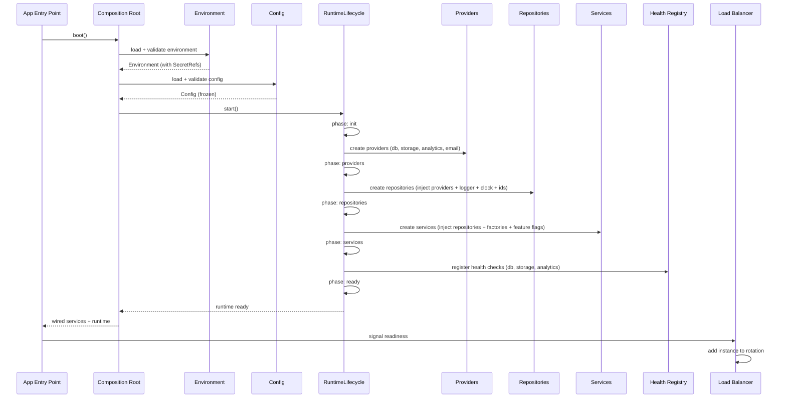
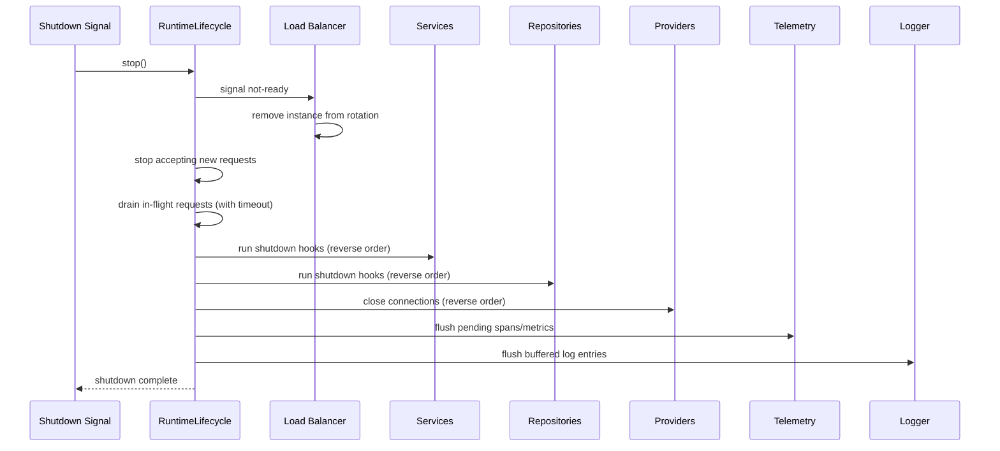
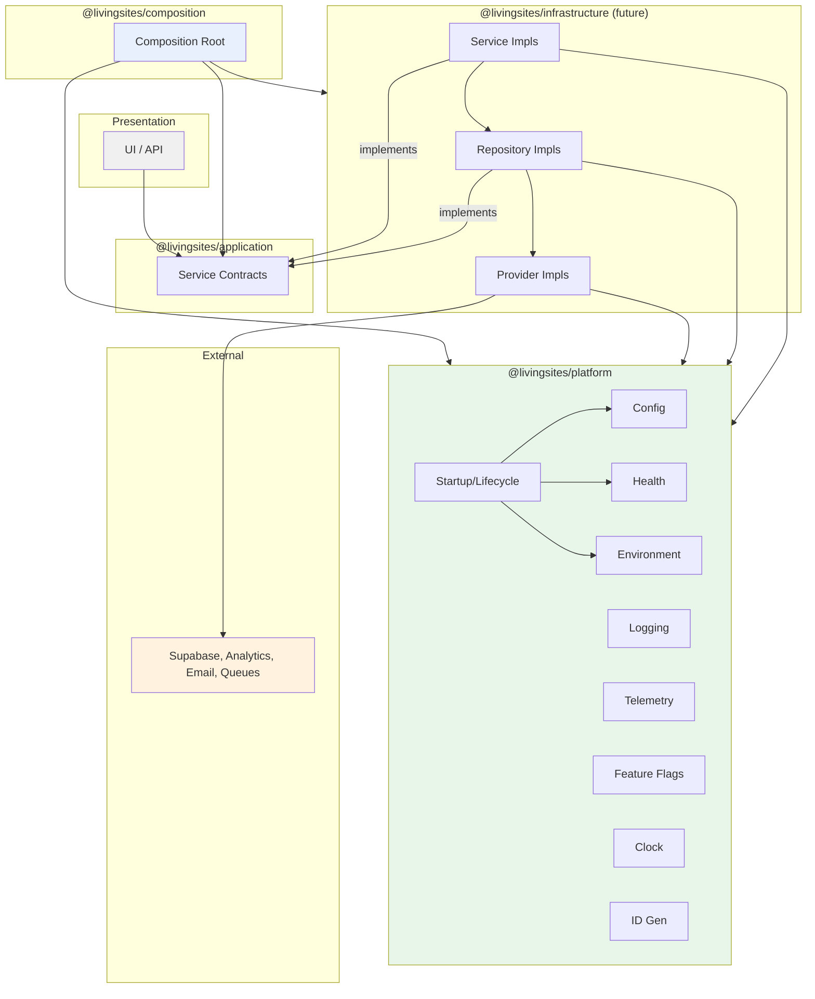
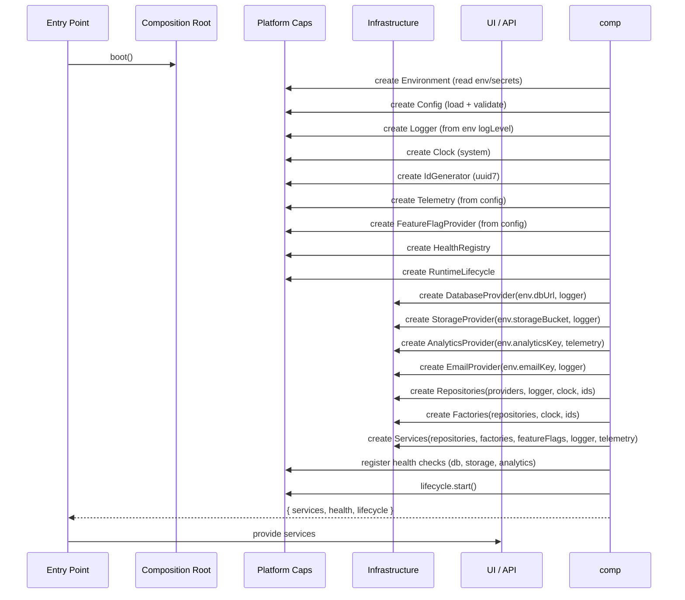
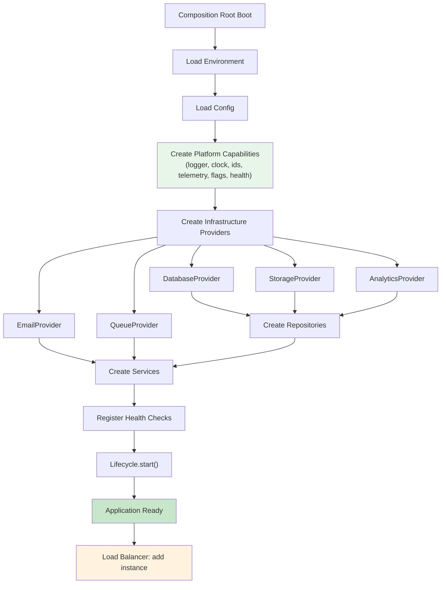
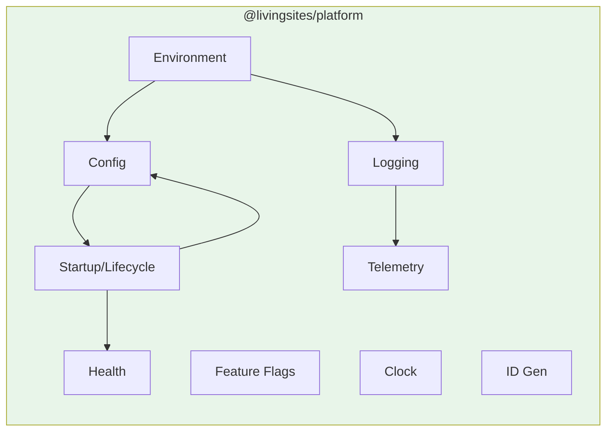

# Living Sites — Platform Runtime

> **Status:** Architecture only. No implementation in this milestone.

## 1. Overview

The Platform Runtime layer provides **provider-independent runtime
capabilities** that every Living Sites application depends on. These
capabilities are cross-cutting concerns — configuration, environment, logging,
telemetry, feature flags, clock, ID generation, health checks, and lifecycle
management — that sit below the application layer and above raw infrastructure.

Platform is a **leaf dependency**: it depends on no other `@livingsites/*`
package. Infrastructure depends on platform; composition wires platform
capabilities into the object graph; application and domain never import
platform.

## 2. Responsibilities

### Configuration

Typed, read-only application configuration loaded once at boot and frozen for
the application lifetime. Config holds non-secret settings (limits, timeouts,
URLs, defaults). Secrets are handled by the environment module. Config
validation happens at boot — invalid config fails fast, not at first use.

### Environment

Secure access to raw environment variables and secrets. The environment
module reads from the host, validates required values, and returns `SecretRef`
references for secrets — never raw secret strings. Only infrastructure
providers resolve a `SecretRef` to the actual credential, and only at
connection time. Environment is read once at boot and frozen.

### Logging

Structured, leveled logging contract. Every runtime service uses the `Logger`
interface to emit diagnostic output. Loggers are hierarchical (child loggers
inherit parent level and sinks but add a scoped name) and structured (fields
objects, not string interpolation). Logging is fire-and-forget — never
blocking. No secrets in logs.

### Health Checks

Liveness and readiness probes. Liveness proves the process is alive (trivial);
readiness proves the process can serve traffic (database reachable, storage
reachable). Health checks have timeouts and are inexpensive. `degraded` is a
first-class state for when non-critical dependencies are down but the core is
up — traffic still routes.

### Telemetry

Metrics and tracing contracts. The `Meter` interface records counters, gauges,
and histograms; the `Tracer` interface creates spans with parent-child
relationships. Telemetry is non-blocking, optional (no-op if no sink
configured), and provider-agnostic. Traces propagate correlation ids that link
to logs.

### Feature Flags

Dynamic, runtime-evaluated feature flags. Distinct from domain `Feature`
entities (plan-gated entitlements) and from config (static at boot). Flags
support boolean enablement and string variants for A/B testing. Flags fail
open or closed explicitly — if the provider is unavailable, a configurable
default is returned, never an exception. Flags are re-evaluated per operation,
never cached long-term.

### Clock

Time abstraction so services never call `Date.now()` directly. The `Clock`
interface returns ISO-8601 UTC strings and Unix epoch milliseconds. Tests
inject a fixed clock; production uses the system clock. All times are UTC;
local time formatting is a presentation concern. Clock is singleton.

### ID Generation

Unique identifier generation contract. Centralizes ID format (UUID v7 or ULID
for time-sortable keys), ensures testability (deterministic generators for
tests), and supports prefixed IDs (e.g. `org_01J...`, `page_01J...`) for
human readability. IDs are strings; the domain brands them into typed IDs.
ID generation is injectable.

### Startup

Application lifecycle: the ordered sequence of phases that bring the platform
from cold to ready, and the reverse sequence for graceful shutdown. Startup
hooks run in registration order within a phase; phases run in fixed order
(init → providers → repositories → services → ready). Shutdown hooks run in
reverse order. Shutdown is graceful — in-flight requests drain with a
configurable timeout before forced shutdown. Readiness is exposed as an
explicit probe for external orchestrators.

### Graceful Shutdown

The reverse of startup. When a shutdown signal is received (SIGTERM,
SIGINT, or programmatic), the runtime:

1. Stops accepting new requests.
2. Drains in-flight requests (with a timeout).
3. Runs shutdown hooks in reverse registration order.
4. Releases resources acquired last-first.
5. Forces shutdown after the timeout if draining is incomplete.

This ensures no data corruption (connections close cleanly, queues flush,
telemetry exports) and no dropped requests (load balancer removes the instance
from rotation before shutdown completes).

## 3. Dependency Boundaries

```
UI / API
    →  @livingsites/application  (service contracts)
        →  @livingsites/domain   (entities)

@livingsites/composition
    →  @livingsites/application  (wires services)
    →  @livingsites/platform     (wires runtime capabilities)
    →  @livingsites/infrastructure (future: wires concrete implementations)

@livingsites/infrastructure (future)
    →  @livingsites/platform     (uses logger, clock, ids, config)
    →  @livingsites/application  (implements repository/service contracts)
    →  @livingsites/domain       (entity types for persistence)

@livingsites/platform
    →  (nothing internal)        ← leaf dependency
```

Key rules:

- **Platform depends on nothing internal.** It is the lowest `@livingsites/*`
  package. No import in `packages/platform/` may reference domain, application,
  composition, or infrastructure.
- **Infrastructure depends on platform.** A Supabase repository implementation
  uses `Logger`, `Clock`, `IdGenerator`, and `Config` from platform.
- **Domain never imports platform.** Domain is pure business model; runtime
  capabilities are irrelevant to it.
- **Application never imports platform.** Application defines service
  contracts; it does not depend on runtime capabilities. Services *use*
  platform capabilities at runtime (injected by composition), but the
  application package itself has no platform dependency.
- **UI never imports platform directly.** The UI receives runtime-influenced
  behavior through services wired by composition.

## 4. Future Extensibility

- **New telemetry backends.** A new `TelemetrySink` implementation (e.g.
  OpenTelemetry, Datadog) can be added in infrastructure without changing
  platform contracts or services.
- **New feature flag providers.** A remote flag service (e.g. LaunchDarkly,
  Posthog) can implement `FeatureFlagProvider` without changing services.
- **New config sources.** A remote config service (e.g. AWS AppConfig, a
  database-backed config table) can implement `ConfigSource` without changing
  consumers.
- **New ID formats.** A new `IdFormat` (e.g. Snowflake IDs for distributed
  generation) can be added to the enum and implemented without changing the
  `IdGenerator` contract.
- **Platform plugins.** Future platform capabilities (e.g. a distributed
  cache contract, a rate limiter contract) can be added as new modules under
  `packages/platform/src/` following the same pattern (README + index.ts).

## 5. Runtime Lifecycle

### Startup Sequence



### Shutdown Sequence



### Dependency Resolution



### Object Creation Flow



### Future Provider Registration



## 6. Module Relationship



Platform modules have minimal internal dependencies: environment feeds config
and logging; config feeds startup; startup orchestrates health; logging feeds
telemetry (correlation ids). Most modules are independent and can be wired in
parallel.
