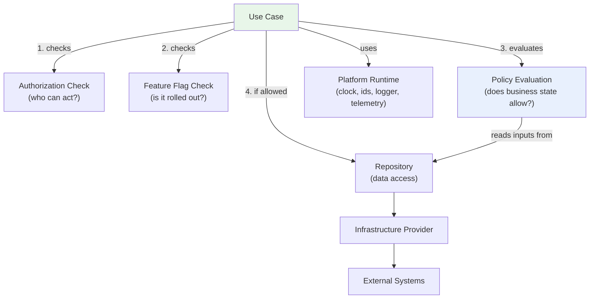
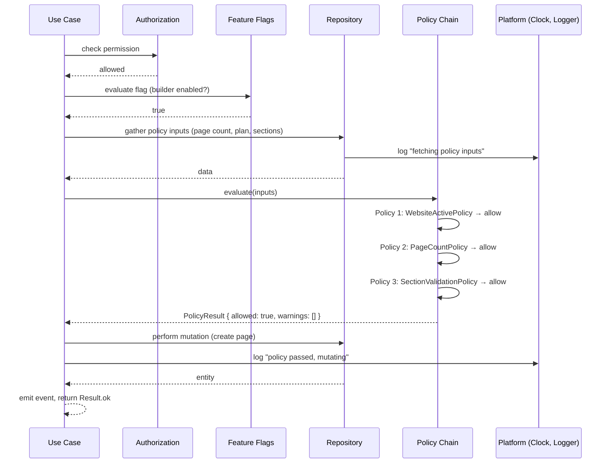
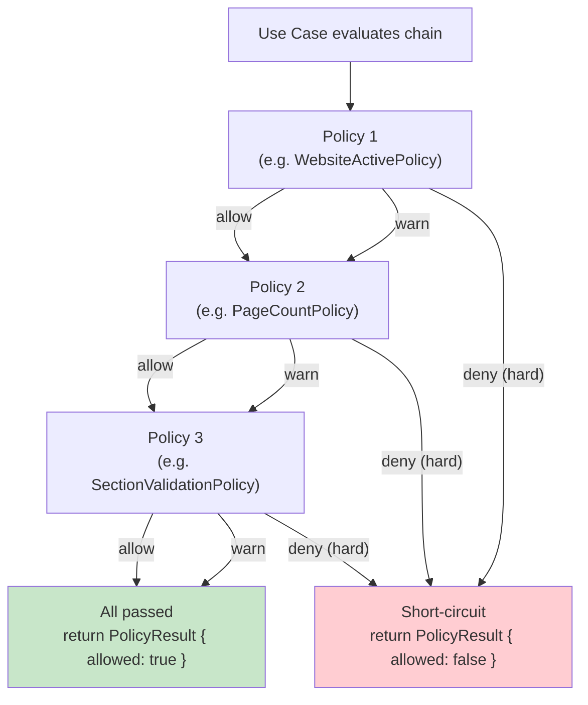
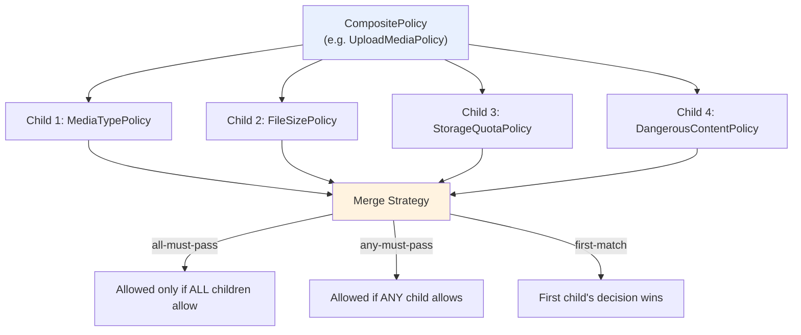
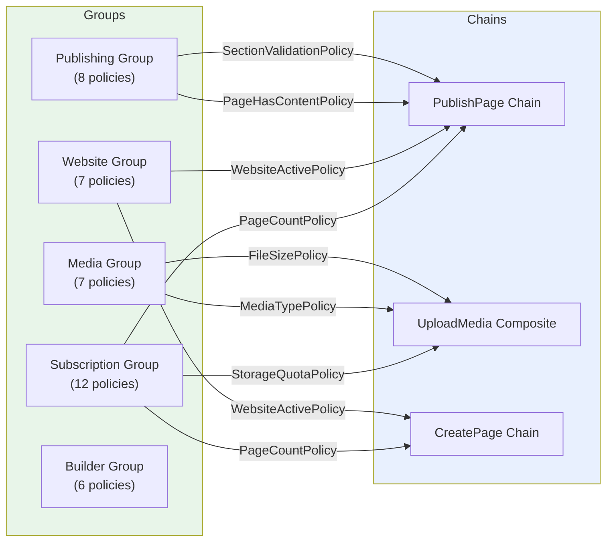
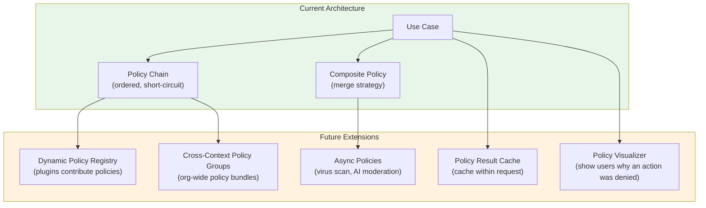

# Living Sites — Policy Engine

> **Status:** Architecture only. No implementation in this milestone.

## Overview

The policy engine is the architectural concept that governs how business
policies are evaluated within use cases. Policies are first-class, reusable,
deterministic functions that determine whether an operation is allowed based
on business constraints. The engine defines how policies are composed into
chains, groups, and composite structures, and how their results are merged
into a single decision.

The policy engine is **not a runtime service**. It is a set of contracts and
conventions that use cases follow. Use cases assemble policy inputs, evaluate
policies, and act on the results. The engine provides the vocabulary
(`Policy`, `PolicyChain`, `CompositePolicy`, `PolicyGroup`) and the merge
semantics; the use case provides the orchestration.

## Position in the Architecture



A use case evaluates policies **after** authorization and feature flag checks
but **before** any mutation. This ordering is deliberate:

1. **Authorization** — is this user allowed to act? (Identity + membership)
2. **Feature flags** — is this capability rolled out? (Platform runtime)
3. **Policies** — does business state permit this specific action? (Business rules)
4. **Mutation** — if all three pass, the use case proceeds to repository writes.

Policies may read from repositories to gather their inputs (e.g. fetching
current page count for `PageCountPolicy`), but the policy itself never calls
the repository — the use case fetches the data and passes it as input.

## Policy Evaluation Flow



### Policy Result Structure

Every policy evaluation returns a `PolicyResult`:

```
PolicyResult {
  allowed: boolean        // true if no hard denials
  decisions: PolicyDecision[]   // all decisions, in order
  warnings: PolicyDecision[]    // soft decisions only
  denials: PolicyDecision[]     // hard denials only
}
```

A `PolicyDecision`:

```
PolicyDecision {
  outcome: "allow" | "deny" | "warn" | "decision"
  policyName: string
  severity: "hard" | "soft"
  message: string
  code: string            // e.g. "PlanLimitReached", "EmptyPage"
  details?: Record        // e.g. { current: 10, max: 10 }
  data?: Record           // for "decision" outcomes (keep/purge, hot/cold)
}
```

## Policy Chains

A **policy chain** is an ordered sequence of policies evaluated in order. The
chain short-circuits on the first hard denial — subsequent policies are not
evaluated. Warnings are accumulated but do not stop the chain.



### Chain semantics

- **Hard deny stops the chain.** No further policies are evaluated.
- **Soft warn continues the chain.** The warning is accumulated.
- **Allow continues the chain.** No decision recorded (or an `allow` decision
  for audit).
- **Decision outcomes continue the chain.** They are accumulated like warnings.
- **The final result** aggregates all decisions, warnings, and denials.

### Example: PublishPage chain

```
PublishPagePolicyChain:
  1. WebsiteActivePolicy (hard)     — is the website active?
  2. PageHasContentPolicy (hard)    — does the page have sections?
  3. SlugUniquenessPolicy (hard)    — is the slug unique?
  4. SectionValidationPolicy (hard) — are all section props valid?
  5. OrphanedSectionPolicy (soft)   — any unregistered section types?
  6. PublishCooldownPolicy (soft)   — was it published too recently?
```

## Composite Policies

A **composite policy** combines multiple child policies with a merge strategy.
Unlike a chain (which is ordered and short-circuits), a composite policy
evaluates all children and merges their results.



### Merge strategies

| Strategy | Semantics |
|---|---|
| `all-must-pass` | All children must return `allow` or `warn`. Any `deny` fails the composite. |
| `any-must-pass` | At least one child must return `allow`. All `deny` fails the composite. |
| `first-match` | The first child that returns `deny` or `warn` wins. If all `allow`, the composite allows. |

### Example: UploadMedia composite

```
UploadMediaPolicy (CompositePolicy, all-must-pass):
  - MediaTypePolicy (hard)
  - FileSizePolicy (hard)
  - StorageQuotaPolicy (hard)
  - DangerousContentPolicy (hard)
  - ImageDimensionsPolicy (mixed)
  - DuplicateUploadPolicy (soft)
```

All hard policies must pass. Soft warnings are accumulated. The composite
returns a single `PolicyDecision` that summarizes the child results.

## Policy Groups

A **policy group** is a named collection of policies keyed by bounded context.
Groups are organizational — they help the composition root wire the right
policies into the right use cases. A use case typically evaluates one policy
chain, which may pull policies from multiple groups.



### Group semantics

- Policies are **owned by their context group** (e.g. `PageCountPolicy` is
  owned by the subscription group).
- Chains **borrow policies from multiple groups** — a `PublishPage` chain
  uses policies from subscription, website, and publishing groups.
- Groups are **wired by the composition root** — the composition root
  assembles chains and composites from the available policies and injects
  them into use cases.
- A policy may appear in **multiple chains** — `StorageQuotaPolicy` appears
  in both the `UploadMedia` composite and the `CreatePage` chain (if page
  creation involves storage).

## Failure Handling

When a policy chain returns `allowed: false`, the use case does not perform
the mutation. Instead, it maps the denial to a `DomainError`:

```
Use Case flow:
  1. Evaluate policy chain
  2. If allowed === false:
     - Map the first denial to a DomainError
     - Return Result.error(DomainError)
     - No mutation, no event emission
  3. If allowed === true with warnings:
     - The use case may proceed (warnings are advisory)
     - OR the use case may require user confirmation for warnings
       (surfaced via a "confirm" field in the UI)
  4. If allowed === true with no warnings:
     - Proceed with the mutation
```

### Warning handling

Warnings are advisory — they do not block the operation. The use case
includes warnings in its return value so the UI can display them. For
operations where the user should confirm before proceeding despite warnings
(e.g. "archiving this website will remove 15 published pages"), the use case
accepts a `confirmWarnings: boolean` input. If warnings exist and
`confirmWarnings` is false, the use case returns the warnings without
mutating. If `confirmWarnings` is true, it proceeds.

## Overrides

Policy overrides are **explicit, auditable, and narrow**. An override does not
disable a policy — it records that a specific policy was overridden for a
specific operation, with a reason.

### Override types

| Type | Description | Example |
|---|---|---|
| **Platform admin override** | A platform admin bypasses a policy for a specific operation. | Admin forces a publish despite a validation warning. |
| **Plan exception** | An org has a negotiated exception to a plan limit. | Custom `maxWebsites` stored on the org, overriding the plan. |
| **Maintenance exemption** | An operation is exempt from the maintenance window policy. | Health checks run during maintenance. |

Overrides are logged via the platform logger and recorded in the audit trail.
They are never silent. The `PolicyContext` includes an optional
`overrideReason` field — if present, the policy chain records the override in
its decisions but does not deny.

## Exceptions

Policy evaluation should never throw. Policies are deterministic functions
that return a `PolicyDecision`. If a policy encounters an internal error (e.g.
malformed input), it returns a `deny` decision with `code: "PolicyError"` and
the error details. The use case treats this as a denial.

The only exception is if a policy's input is missing required data — in that
case, the use case should not call the policy at all. The use case is
responsible for gathering complete inputs before evaluation.

## Future Composition



### Future extensibility points

- **Plugin-contributed policies.** Plugins register policies into the policy
  registry. Use case chains dynamically include plugin policies. A plugin
  could add a `ContentPolicy` that screens for prohibited keywords before
  publish.

- **Async policies.** Some policies need external services (virus scanning,
  AI content moderation). The `Policy.evaluate` method returns a `Promise`,
  so async policies are already supported by the contract. The use case
  awaits the evaluation.

- **Policy result caching.** Within a single request, multiple use cases may
  evaluate the same policy (e.g. `PlanActivePolicy`). A request-scoped cache
  avoids redundant evaluation. This is a composition-root concern.

- **Cross-context policy bundles.** An org may purchase a "compliance bundle"
  that adds policies across multiple contexts (e.g. GDPR data residency
  policies affecting storage, media, and export). The bundle is a policy group
  that spans contexts.

- **Policy visualizer.** When a user is denied an action, the UI can display
  which policy denied it and why. The `PolicyDecision` includes `message`,
  `code`, and `details` sufficient for a human-readable explanation.
