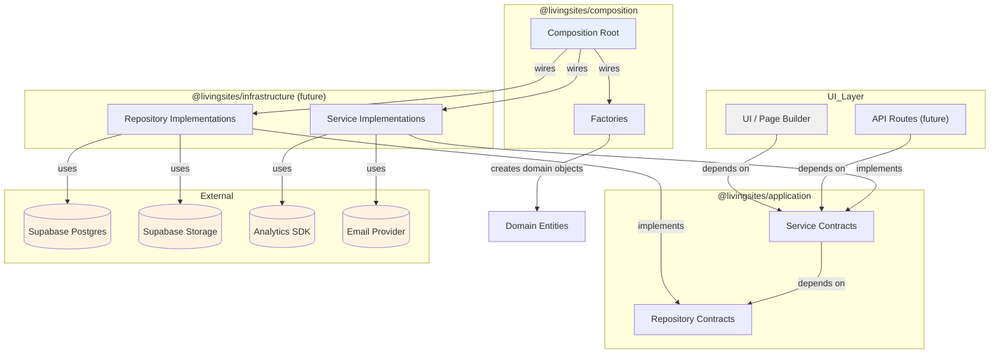
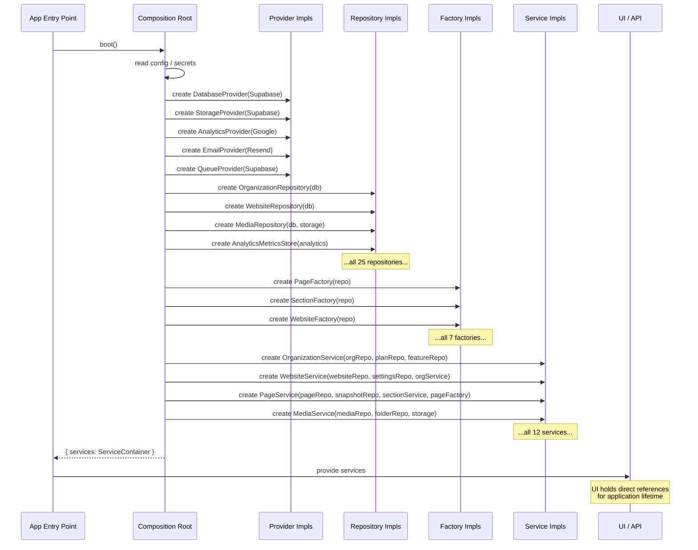
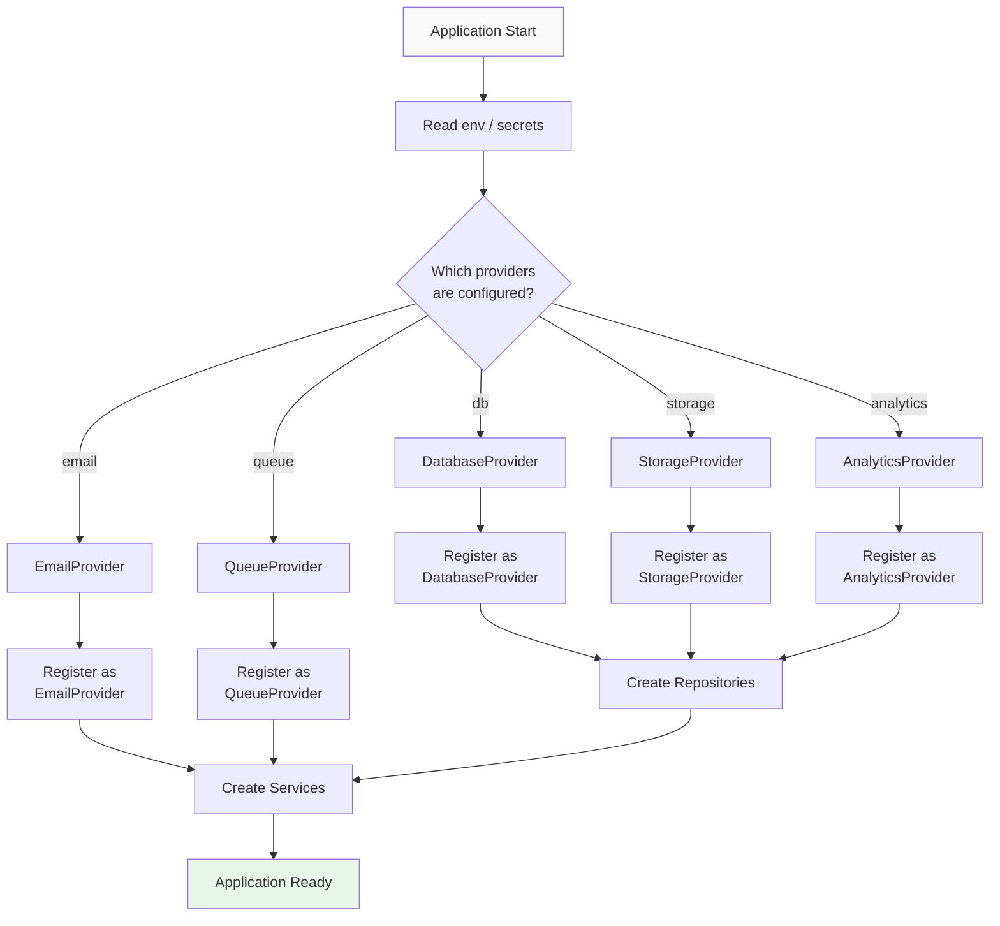

# Dependency Resolution

> **Status:** Architecture documentation. No implementation in this milestone.

## Overview

Living Sites uses a strict layered architecture with a single composition root.
Dependencies flow in one direction; concrete implementations are known only to
the composition package.

## The dependency chain

```
UI / API
    ↓  depends on
Application Services (contracts in @livingsites/application)
    ↓  depends on
Repositories (contracts in @livingsites/application)
    ↓  implemented by
Infrastructure Providers (future: @livingsites/infrastructure)
    ↓  talk to
External Systems (Supabase Postgres, Storage, Auth, Analytics SDKs, Email, Queues)
```

Each layer depends on the **contract** of the layer below, never on a concrete
implementation. The composition root is the only place where contracts are
bound to implementations.

## How assembly works

### Step 1 — Boot reads configuration

The composition root reads environment variables and secrets. It knows which
database, storage, analytics, email, and queue providers to instantiate. This
knowledge lives nowhere else.

### Step 2 — Providers are created

The composition root instantiates infrastructure providers (database client,
storage client, analytics SDK, etc.). Each provider is configured with its
connection details and credentials. Providers are singleton lifetime — one
instance per provider for the application's lifetime.

### Step 3 — Repositories are created

The composition root instantiates repository implementations, injecting the
providers each repository needs. For example, `SupabaseMediaRepository` receives
both the database client and the storage client. Repositories are singleton
lifetime.

### Step 4 — Services are created

The composition root instantiates service implementations, injecting the
repositories and other services each service needs. For example,
`PageServiceImpl` receives `PageRepository`, `PageSnapshotRepository`, and
`SectionService`. Services are singleton lifetime (except `BuilderService`,
which is scoped — see below).

### Step 5 — Factories are created

The composition root instantiates factory implementations and injects them
into the services that need them. For example, `PageServiceImpl` receives
`PageFactory`.

### Step 6 — Wired services handed to the UI

The fully wired service instances are handed to the UI/API entry point. The UI
holds direct references for the application's lifetime. It never sees
repositories, providers, or the composition root itself after this point.

## Why only the Composition package knows concrete implementations

### 1. Replaceability

If the UI or services imported concrete repository implementations, swapping
Supabase for another provider would require changes throughout the codebase.
Because only the composition root imports implementations, a provider swap is
a single-file change in the composition root.

### 2. Testability

Tests can substitute mock or in-memory implementations by building a
parallel object graph. Since services depend on contracts (interfaces), a
test wires mocks against the same contracts — no monkey-patching, no
framework-specific test utilities.

### 3. Security

Providers carry credentials and connection details. If the UI or services
could access providers directly, credentials could leak into client-side
bundles or log statements. The composition root absorbs all credential
handling; everything above it sees only abstractions.

### 4. Single responsibility

Each layer does one thing:

- **Domain** — defines what the business entities are.
- **Application** — defines what operations exist (contracts).
- **Infrastructure** (future) — implements how data is persisted and how
  external systems are called.
- **Composition** — decides which implementations are used and wires them.
- **UI** — presents data and captures user intent.

No layer crosses responsibilities. The composition root is the only layer that
knows "which" and "how"; every other layer knows only "what."

## Enforcement

This separation is enforced by import boundaries:

- `@livingsites/domain` imports nothing external.
- `@livingsites/application` imports only `@livingsites/domain`.
- `@livingsites/composition` imports `@livingsites/application` and (future)
  `@livingsites/infrastructure`.
- UI imports only `@livingsites/application` (service contracts).
- No package imports `@livingsites/composition` except the application entry
  point.

A lint rule should enforce: no file outside `packages/composition/` may import
from `@livingsites/infrastructure` or reference a concrete implementation
class.

## Diagram: Dependency Resolution



## Diagram: Object Creation Flow

This shows what happens when the application boots and the object graph is
assembled.



## Diagram: Future Provider Registration

This shows how the composition root will register providers when the
infrastructure layer exists.



## Service Lifetime Strategy

> **Documentation only. No implementation in this milestone.**

### Singleton

One instance shared across the entire application lifetime. Created at boot,
never recreated.

**Applies to:** All providers, all repositories, and most services
(OrganizationService, MembershipService, WebsiteService, PageService,
SectionService, MediaService, SEOService, AnalyticsService, FormService,
ExportService, RenderingService).

**Rationale:** These services are stateless adapters or orchestrators. There
is no benefit to multiple instances, and sharing a single instance avoids
redundant connection pools and cache duplication.

### Scoped

One instance per scope (e.g. per HTTP request, per builder session). Created
when the scope begins, disposed when the scope ends.

**Applies to:** `BuilderService` (may carry per-session builder state such as
optimistic UI coordination and conflict detection).

**Rationale:** The builder service may hold short-lived state tied to a single
editing session. A singleton would leak state between concurrent editors; a
transient would lose state between operations in the same session.

### Transient

A new instance every time one is requested.

**Applies to:** Factories (if they carry no reusable state). Most factories
can be singletons, but if a factory needs per-call configuration (e.g. a
scoped locale or tenant), it may be transient.

**Rationale:** Factories that produce objects with per-call context should not
retain that context between calls. Transient lifetime ensures each request
gets a clean instance.
