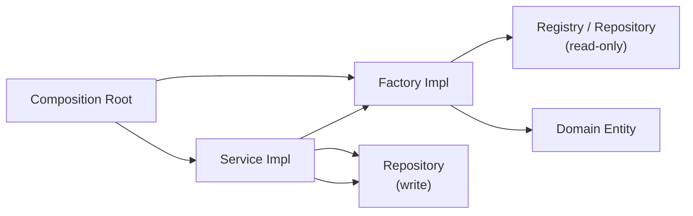

# Factories

> **Status:** Documentation only. No implementation in this milestone.

## Purpose

Factories are the future mechanism for creating **complex objects** whose
construction requires more than a simple `new` call — objects that need data
fetching, default-value resolution, multi-step assembly, or conditional
construction logic.

Factories are distinct from the composition root's wiring role:

- **Composition root** wires the object graph at application startup
  (providers → repositories → services).
- **Factories** create domain objects and DTOs at runtime, on demand, when
  business operations require them.

## What factories will create

| Factory | Creates | Why a factory |
|---|---|---|
| `PageFactory` | `Page` with defaults | New pages need homepage uniqueness checks, default SEO, slug validation, and section-order initialization — too complex for a bare constructor. |
| `SectionFactory` | `Section` from a SectionType | Must resolve the SectionType from the registry, initialize props from the schema defaults, and assign a sort order. |
| `WebsiteFactory` | `Website` with defaults | Needs plan-limit checks, fallback-domain generation, default-locale setup, and initial theme resolution. |
| `FormFactory` | `Form` from a field spec | Must validate field keys, assign field ids, and set default notification/spam config. |
| `MediaFactory` | `Media` from upload metadata | Must assign folder, generate storage path, and set default metadata. |
| `ExportJobFactory` | `ExportJob` from scope + format | Must assign initial status, generate job id, and set requestedAt. |
| `SubmissionFactory` | `Submission` from form + values | Must validate against form fields, apply spam screening, and capture source/meta. |

## Factory principles

1. **Factories create; they do not persist.** A factory returns a new domain
   object in memory. Persistence is the repository's job, called by the
   service after the factory produces the object.
2. **Factories may read but not write.** A factory may consult a repository
   (e.g. to check slug uniqueness) but never persists. This keeps the
   read-check-write sequence in the service, which owns the transaction
   boundary.
3. **Factories are injected, not globally accessed.** Services receive their
   factories as constructor parameters from the composition root, just like
   repositories.
4. **Factories return domain types, not DTOs.** The output of a factory is
   always a `@livingsites/domain` entity or value object.

## Relationship to the composition root

The composition root instantiates factories alongside services and injects
both into the services that need them. Factories may depend on repositories
(read-only) and on the domain model, but never on services.

## What factories are NOT

- **Not part of the domain package.** Factories have dependencies on
  repositories and registries; the domain package depends on nothing.
- **Not a replacement for constructors.** Simple domain objects (value
  objects, branded IDs) are constructed directly. Factories are only for
  objects with complex construction logic.
- **Not where business rules live.** The factory assembles an object with
  correct defaults and validated structure. Business rules (e.g. "can this
  org have another website?") are enforced by the service.
