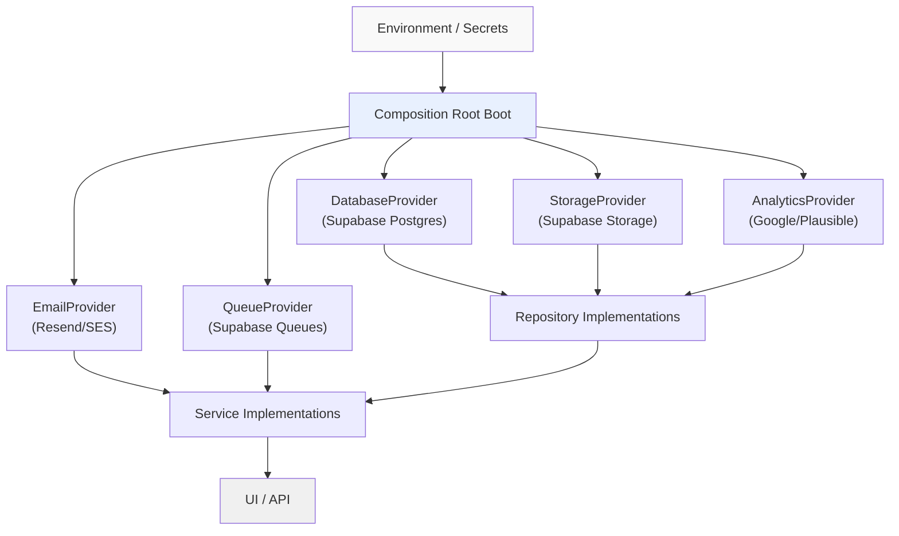

# Provider Registry

> **Status:** Documentation only. No implementation in this milestone.

## Purpose

The provider registry is the future mechanism by which the composition root
records which infrastructure provider implementation is active for each
provider contract. Providers are the lowest-level building blocks: database
clients, storage clients, cache clients, analytics SDKs, email senders, etc.

Providers are **not** defined in `@livingsites/application` — they are
infrastructure-level contracts that will live in a future
`@livingsites/infrastructure` package. The composition root is the only place
that knows which concrete provider implementations are used.

## How it will work

At application boot, the composition root will:

1. Read configuration (environment variables, secrets).
2. Instantiate concrete **adapter implementations** from
   `@livingsites/infrastructure` (e.g. a Supabase database adapter, a
   Supabase storage adapter, a Resend email adapter).
3. Register each adapter in the provider registry.
4. Hand adapters to **repository adapter implementations** (which use
   `DatabaseAdapter`, `StorageAdapter`, etc. to fulfill application-layer
   repository contracts).
5. Bind repository adapters to application-layer repository ports.

The infrastructure package (`@livingsites/infrastructure`) defines the
adapter contracts — `DatabaseAdapter`, `StorageAdapter`, `EmailAdapter`,
`QueueAdapter`, etc. — and repository adapter contracts —
`OrganizationRepositoryAdapter`, `WebsiteRepositoryAdapter`, etc. — that
adapter implementations will fulfill. The composition root is the only place
that knows which concrete adapter implementations are used.

## Future provider contracts

| Provider | Backing service | Consumers |
|---|---|---|
| `DatabaseProvider` | Supabase Postgres | All repository impls |
| `StorageProvider` | Supabase Storage | MediaRepository, MediaService |
| `AuthProviders` | Supabase Auth | MembershipService (future) |
| `AnalyticsProvider` | Google / Plausible / Fathom | AnalyticsMetricsStore |
| `EmailProvider` | Resend / SES | FormService (notifications) |
| `QueueProvider` | Supabase Queues / Redis | ExportService |
| `CacheProvider` | Redis / in-memory | RenderingService (future) |

## Why providers are invisible to the UI

Providers deal with connection strings, SDK configuration, and external system
credentials. The UI must never know which database, storage, or email provider
is in use. The composition root absorbs that knowledge; everything above the
composition root sees only application-layer contracts.

## Diagram

