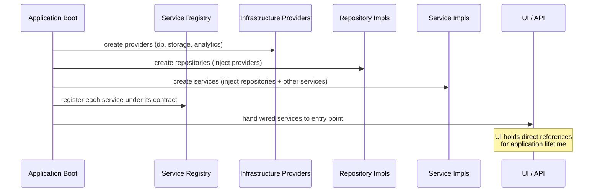

# Service Registry

> **Status:** Documentation only. No implementation in this milestone.

## Purpose

The service registry is the future mechanism by which the composition root
records which concrete implementation satisfies each service contract. It is
**not** a service locator pattern — the registry is used exclusively at
application startup (the composition root) to build the object graph. After
startup, services hold direct references to their dependencies; the registry
is not consulted at runtime.

## How it will work

At application boot, the composition root will:

1. Instantiate infrastructure providers (database client, storage client,
   analytics SDK, etc.).
2. Instantiate repository implementations, injecting the providers they need.
3. Instantiate service implementations, injecting the repositories and other
   services they need.
4. Register each service in the service registry under its contract type.
5. Hand the registry (or a frozen snapshot of it) to the UI/API entry point.

The UI/API layer then resolves services by contract from the registry — once,
at startup — and holds the reference for the application's lifetime.

## Registered services (future)

| Contract | Lifetime | Notes |
|---|---|---|
| `OrganizationService` | Singleton | Stateless; safe to share. |
| `MembershipService` | Singleton | Stateless; safe to share. |
| `WebsiteService` | Singleton | Stateless; safe to share. |
| `PageService` | Singleton | Stateless; safe to share. |
| `SectionService` | Singleton | Stateless; safe to share. |
| `MediaService` | Singleton | Holds upload config; safe to share. |
| `SEOService` | Singleton | Stateless; safe to share. |
| `AnalyticsService` | Singleton | Holds provider config; safe to share. |
| `FormService` | Singleton | Stateless; safe to share. |
| `ExportService` | Singleton | Holds queue config; safe to share. |
| `BuilderService` | Scoped | May carry per-request builder session state. |
| `RenderingService` | Singleton | Stateless; safe to share. |

## What the registry is NOT

- **Not a service locator.** Services do not look up their dependencies from
  the registry at runtime. Dependencies are injected as constructor parameters
  at composition time.
- **Not global state.** The registry is created in the composition root and
  either discarded after wiring or frozen into a read-only container.
- **Not accessible to the UI.** The UI receives already-wired service
  instances. It does not see the registry.

## Diagram

